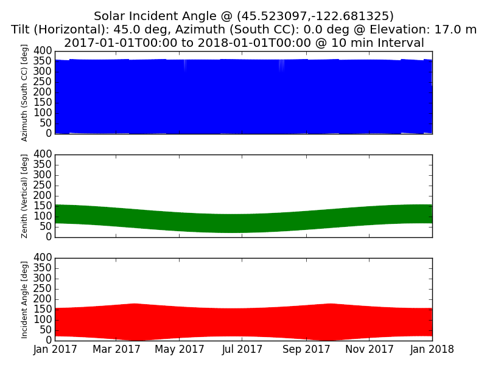

# python-solar-incidentangle

<h1>Solar Incident Angle Calculator</h1>

A python-based calculator for determing the incident angle of a solar panel at a specified latitude/longitude, elevation, tilt angle and azimuth angle.

Based on the following references...

Solar Position Code
<a href="https://github.com/s-bear/sun-position">https://github.com/s-bear/sun-position</a>

Solar Position Theory
<a href="http://www.me.umn.edu/courses/me4131/LabManual/AppDSolarRadiation.pdf">http://www.me.umn.edu/courses/me4131/LabManual/AppDSolarRadiation.pdf/</a>
